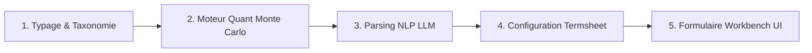

# 📘 Guide d'Intégration d'un Nouveau Payoff dans StructAI

Ce document décrit la procédure étape par étape pour ajouter un nouveau type de produit structuré (ex: *Autocall Step-Down*, *Twin-Win*, *Discount Certificate*, *Phoenix Memory Multi-Sous-Jacents*) dans l'application **StructAI**.

---

## 🏗️ Architecture Globale d'un Payoff

L'intégration d'un nouveau payoff implique 5 étapes principales :



---

## 📑 Étape 1 : Typage et Taxonomie Produits

### 1.1 Définir le type dans `src/types/structured-product.ts`

1. Ajouter l'identifiant du nouveau type dans le type union `ProductTypeId` :
```typescript
export type ProductTypeId =
  | 'AUTOCALL_CLASSIC'
  | 'PHOENIX_MEMORY'
  | 'REVERSE_CONVERTIBLE'
  | 'CAPITAL_PROTECTION'
  | 'NOUVEAU_PAYOFF_ID'; // <-- Ajouter ici
```

2. Si le payoff requiert des paramètres spécifiques (ex: un facteur d'Airbag, un pas de Step-Down), enrichir l'interface `AutocallSpecificParameters` ou créer une interface dédiée :
```typescript
export interface NouveauPayoffSpecificParameters {
  autocallBarrierPct?: number;
  stepDownPctPerPeriod?: number; // Ex: baisse de 2.5% du seuil par trimestre
  airbagBufferPct?: number;      // Ex: barrière airbag à 50%
  pdiBarrierPct?: number;
  memoryCoupon?: boolean;
}
```

### 1.2 Enregistrer le produit dans `src/data/product-taxonomy.ts`

Ajouter la fiche produit dans l'objet `PRODUCT_TAXONOMY` :

```typescript
NOUVEAU_PAYOFF_ID: {
  id: 'NOUVEAU_PAYOFF_ID',
  name: 'Autocall Step-Down Memory',
  family: 'YIELD_ENHANCEMENT',
  description: 'Autocall dont la barrière de remboursement anticipé diminue à chaque date de constatation.',
  commonParamsSchema: ['underlyings', 'maturityMonths', 'observationFrequency', 'nonCallMonths', 'forwardStartMonths', 'currency'],
  specificParamsSchema: ['autocallBarrierPct', 'stepDownPctPerPeriod', 'pdiBarrierPct', 'memoryCoupon'],
  defaultParams: {
    autocallBarrierPct: 100,
    stepDownPctPerPeriod: 2.5,
    pdiBarrierPct: 65,
    memoryCoupon: true,
  },
}
```

---

## 🧮 Étape 2 : Implémenter le Payoff dans le Moteur Quant (`src/services/quant-pricer.ts`)

Le moteur de simulation Monte Carlo évalue les trajectoires d'actifs et résout les cibles (ex: Taux de coupon annuel solvé pour atteindre une Fair Value de 100%).

Dans `src/services/quant-pricer.ts`, ajouter ou adapter la logique de payoff :

```typescript
// Exemple de boucle de simulation Monte Carlo pour un nouveau payoff
if (spec.productTypeId === 'NOUVEAU_PAYOFF_ID') {
  let autocallBarrier = initialAutocallBarrier - (stepIndex * stepDownAmount);
  if (assetPriceAtT >= autocallBarrier) {
    // Calcul du remboursement anticipé + coupons mémoires
  }
}
```

---

## 🧠 Étape 3 : Entraîner / Adapter le Parsing NLP LLM

### 3.1 Prompt Système (`quotation-service/QuotationPrompt.md`)

L'analyse NLP est désormais hébergée dans le service autonome `quotation-service/` (voir son [README](quotation-service/README.md)). Mettez à jour `quotation-service/QuotationPrompt.md` pour indiquer au modèle LLM comment extraire le nouveau `productTypeId` et ses balises spécifiques à partir du langage naturel :

```text
- "step-down" ou "barrière dégressive" -> productTypeId = "NOUVEAU_PAYOFF_ID"
- Extraire "stepDownPctPerPeriod" (ex: 2.5% par trimestre)
```

Aucune étape de "moteur de règles fallback" à maintenir : `quotation-service` n'a pas de mode dégradé déterministe — si le LLM configuré ne reconnaît pas le nouveau payoff, l'erreur ou l'extraction incomplète (via `missingFields`) remonte telle quelle plutôt que d'être masquée par une heuristique de secours.

---

## 📜 Étape 4 : Mapper le Template de Termsheet (`src/assets/app-config.json`)

### 4.1 Enregistrer l'association Payoff ➡️ Template

Dans `src/assets/app-config.json`, ajouter la correspondance dans `termsheetTemplatesByPayoff` :

```json
{
  "termsheetTemplatesByPayoff": {
    "AUTOCALL_CLASSIC": "natixis_cib_standard",
    "PHOENIX_MEMORY": "sg_cib_phoenix",
    "REVERSE_CONVERTIBLE": "bnp_cib_standard",
    "NOUVEAU_PAYOFF_ID": "template_nouveau_payoff"
  }
}
```

### 4.2 Ajouter le Template Markdown (`src/services/termsheet-template.ts`)

Dans `DEFAULT_TERMSHEET_TEMPLATES`, ajouter le modèle Markdown institutionnel correspondant :

```typescript
{
  id: 'template_nouveau_payoff',
  name: 'Modèle Autocall Step-Down Institutionnel',
  issuerLogo: 'STEP-DOWN CIB',
  issuerName: 'Émetteur A+ Européen',
  templateFormat: 'MARKDOWN',
  content: `# TERMSHEET - {{PRODUCT_NAME}}
...
`
}
```

---

## 🎛️ Étape 5 : Ajouter les Contrôles UI dans le Workbench (`src/components/QueryParserWorkbench.tsx`)

Pour permettre à l'utilisateur de surcharger manuellement les nouveaux paramètres dans la **Grille de Paramètres Surchargeables** :

1. Ajouter un champ de saisie (`<input type="number">` ou `<select>`) dans le formulaire de `QueryParserWorkbench.tsx`.
2. Déclencher `handleParamOverride(newSpec, 'nomDuParametre')` lors de la modification.

---

## ✅ Checklist de Validation

- [ ] `npm run lint` s'exécute sans aucune erreur TypeScript.
- [ ] `npm run build` génère le bundle de production avec succès.
- [ ] La saisie NLP d'un exemple contenant le nouveau terme extrait correctement la structure.
- [ ] Le calcul Monte Carlo retourne une Fair Value et un coupon cohérents.
- [ ] L'onglet **Termsheet** se met à jour automatiquement avec le template dédié.
